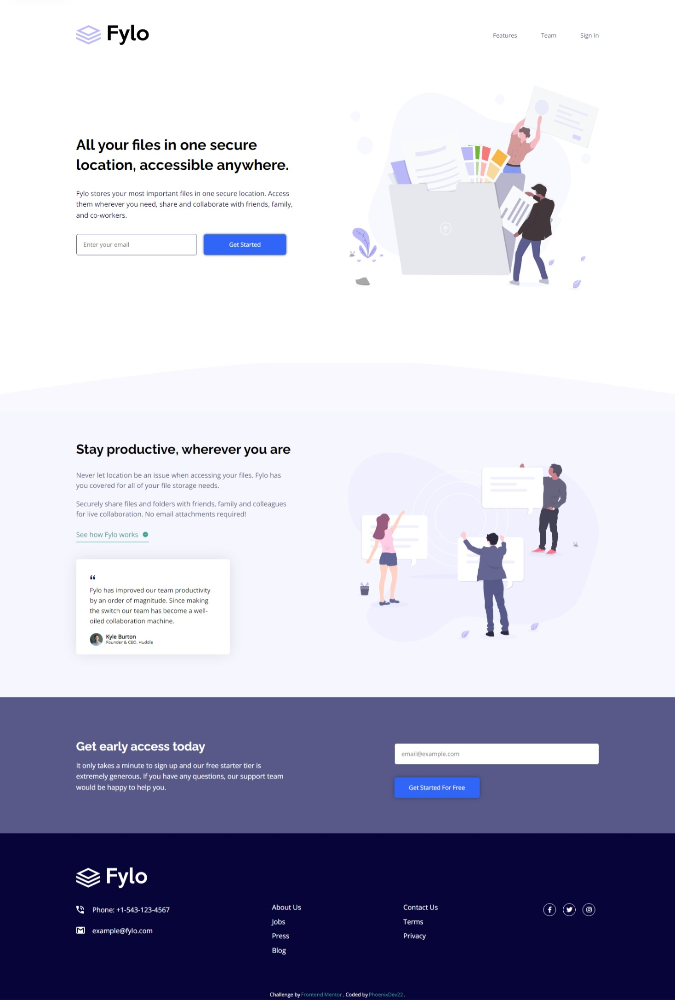

# Frontend Mentor - Fylo landing page with two column layout solution

This is a solution to the [Fylo landing page with two column layout challenge on Frontend Mentor](https://www.frontendmentor.io/challenges/fylo-landing-page-with-two-column-layout-5ca5ef041e82137ec91a50f5). Frontend Mentor challenges help you improve your coding skills by building realistic projects. 


## Table of contents

- [Overview](#overview)
  - [The challenge](#the-challenge)
  - [Screenshot](#screenshot)
  - [Links](#links)
- [My process](#my-process)
  - [What I learned](#what-i-learned)
  - [Continued development](#continued-development)
- [Author](#author)


## Overview

### The challenge


### Screenshot



### Links

- Solution URL: [Solution URL here](https://github.com/PhoenixDev22/Frontend-Mentor-Fylo-landing-page-with-two-column-layout)
- Live Site URL: [Live site URL here hosted on Netlify](https://fylo-landing-page-phoenixdev22.netlify.app/)

## My process

```
const validRegExp = /^[a-zA-Z0-9][\-_\.\+\!\#\$\%\&\'\*\/\=\?\^\`\{\|]{0,1}([a-zA-Z0-9][\-_\.\+\!\#\$\%\&\'\*\/\=\?
\^\`\{\|]{0,1})*[a-zA-Z0-9]@[a-zA-Z0-9][-\.]{0,1}([a-zA-Z][-\.]{0,1})*[a-zA-Z0-9]\.[a-zA-Z0-9]{1,}([\.\-]{0,1}
[a-zA-Z]){0,}[a-zA-Z0-9]{0,}$/i;

```

[This email Regexpression was copied from here.](https://herewecode.io/blog/email-validation-javascript/#:~:text=The%20most%20common%20way%20to%20validate%20an%20email,an%20email%20is%20a%20string%20following%20this%20format%3A)


### Built with

- Semantic HTML5 markup
- CSS custom properties
- Flexbox
- Mobile-first workflow
- Autoprefixer: PostCSS plugin to parse CSS and add vendor prefixes to CSS rules.


### What I learned

- *The Font Awesome library contains too many icons and they are all included in one file. If a designer or layout designer only needs to connect a couple of icons, they still have to load the entire library completely. And these are hundreds of thousands of extra icons that will take up space. However, there is a solution here too - creating your own assembly, which will include only the necessary icons.* So I'll try to create my own collection of required icons.

- Even the Font awesome icons,  if they are decorative should have ``aria-hidden="true"`` to be ignored by assistive technology reader.


### Continued development

- Focusing on accessiblity. 
- Adding animations to the page.
- Learning BEM convention.


## Author

- Frontend Mentor - [@PhoenixDev22](https://www.frontendmentor.io/profile/PhoenixDev22)
- Github - [PhoenixDev22](https://github.com/PhoenixDev22?tab=repositories)


